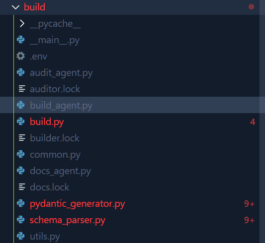

# Napcat Python SDK

## ***介绍***

> 本项目原为AIVK项目前置 功能抽离出来供其他项目使用
> 目前正在开发中
> 设计为MCP服务
平均开发速度 = 净开发动力（ 开发动力 - 开发阻力 ）* 开发时间 / 代码量  

联系作者催更：lightjunction.me@gmail.com

**客户端实现**

* [X] [HTTP客户端](https://github.com/LIghtJUNction/Napcat-PythonSDK/blob/main/src/napcat/clients/http) - 支持同步和异步请求
* [X] [SSE客户端](https://github.com/LIghtJUNction/Napcat-PythonSDK/blob/main/src/napcat/clients/sse/) - 支持事件流接收
* [X] [WebSocket客户端](https://github.com/LIghtJUNction/Napcat-PythonSDK/blob/main/src/napcat/clients/websocket/) - 支持双向实时通信

**服务端实现**

* [ ] [HTTP](https://github.com/LIghtJUNction/Napcat-PythonSDK/blob/main/src/napcat/severs/http/)Napcat服务器
* [ ] WebSocket 服务器

# FastNapcat

综合上述所有客户端，并优化使用体验

**全部端点**

* [] [API](https://github.com/LIghtJUNction/Napcat-PythonSDK/blob/main/data/api_tree.json)

# 贡献指南

* uv pip install -e .[dev]

## 序言

推荐使用vscode + pyright
然后打开插件设置，进行基础设置

## 类型标注

启用严格模式
使用list代替List 而无需额外导入：from typing import List
使用dict代替Dict 而无需额外导入：from typing import Dict
使用tuple代替Tuple 而无需额外导入：from typing import Tuple
使用set代替Set 而无需额外导入：from typing import Set
使用deque代替Deque 而无需额外导入：from collections import deque
使用type代替Type 而无需额外导入：from typing import Type

使用 | None 代替 Optional
使用 | 代替 Union

## 代码注释规范

* 所有类、方法和函数都应该有文档字符串
* API类需包含完整的功能描述、接口地址、参数和返回值说明
* 复杂逻辑应添加行内注释
* 推荐使用 # region 和 # endregion 区域划分代码，方便阅读

## API开发规范

* 参考 `src/napcat/api/memo.md` 中的规范进行开发
* 所有API实现都应遵循标准API类结构
* 使用pydantic进行数据验证和序列化
* 每个API文件末尾应包含测试代码

## AI使用说明




本项目基于openai agents库

基于AI工作流for循环构建API pydantic数据模型

包含以下3大角色

构建者：初步构建

审查者：根据我要求的编码规则审查

文档生成者：生成相应的文档

采用的便宜量大的gemini2.5-flash构建

你也可以使用你的API模型来构建

步骤：

进入终端在项目根目录执行：

uv sync -U 顺便把依赖也更新下

uv pip install -e .[dev] 准备好开发环境

第一步：执行script/check_for_update.py

如果需要更新，请接下来执行

fetch_yaml.py

接下来执行update_meta.py

这个将会生成一份api节点元数据

执行fetch_yaml 在线下载API的描述文件

接着执行yaml_to_json.py

进一步处理方便构建


然后进入机械构建环节，最后才是AI处理

我准备了一套模板代码，先在终端运行

uv run -m build.build build

这一步是简单的变量替换


接下来可以使用ai来构建了

填写.env文件，填好base url api key model name 三大参数

然后运行

build_agent即可

提示词构成：刚刚基于简单变量替换后的模板代码+适合AI阅读的具体的API文档+编码规范


由于有100+ API节点，你完全可以仅构建你想用AI构建的API节点

方法很简单，找到builder.lock 删掉文件名（这个文件记录的是已经构建好的API）

然后重新运行即可，构建时会跳过lock文件内已有的

接下来按相同步骤运行auditor_agent.py

docs_agent.py


然后你就可以提交PR了

当然，提示词部分欢迎修改，就在刚刚我说的这3个AI构建脚本里


对了，不要使用带思维链的模型和用openai兼容API


build/.env 文件示例：

```
API_KEY = "***"

BASE_URL = "https://generativelanguage.googleapis.com/v1beta/openai"

MODEL = "gemini-2.5-flash-preview-05-20"
```

## 不接受的PR

pyright检查不通过的PR
大量使用Any类型标注的PR
注释不清楚的PR
不符合项目编码风格的PR
缺少测试代码的PR

## 代码规范

pyright 检查通过即为规范
推荐使用 # region 区域划分代码 方便阅读
欢迎使用script/pyupgrade.py脚本 来自动化部分升级代码到python3.13规范
